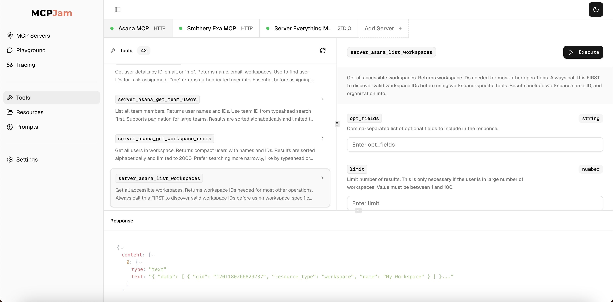
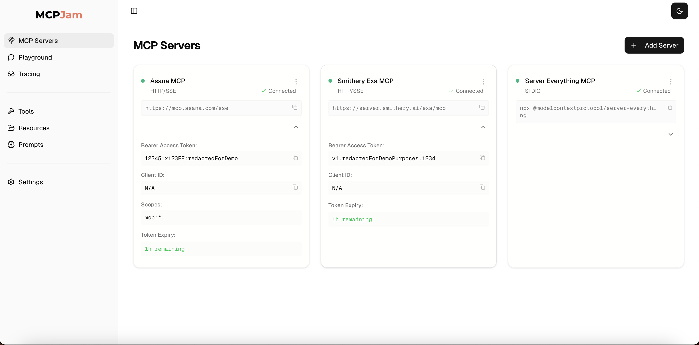

<div align="center">

<picture>
  <source media="(prefers-color-scheme: dark)" srcset="./public/mcp_jam_dark.png">
  <source media="(prefers-color-scheme: light)" srcset="./public/mcp_jam_light.png">
  
</picture>

<br/>

## MCP Server Testing Tool

[](https://www.npmjs.com/package/@mcpjam/inspector)
[](https://opensource.org/licenses/Apache-2.0)
[](https://discord.gg/JEnDtz8X6z)

</div>

A developer tool for testing, debugging Model Context Protocol (MCP) servers. Test whether or not you built your MCP server correctly. The project is open source and fully compliant to the MCP spec.

## Key Features

| Feature                      | Description                                                                                                                              |
| ---------------------------- | ---------------------------------------------------------------------------------------------------------------------------------------- |
| **Full MCP Spec Compliance** | Test your MCP server's tools, resources, prompts, and OAuth 2. MCPJam is compliant with the latest MCP specs.                            |
| **All transports supported** | Connect to any MCP server. MCPJam inspector supports STDIO, SSE, and Streamable HTTP transports.                                         |
| **LLM Playground**           | Integrated chat playground with OpenAI, Anthropic Claude, and Ollama model support. Test how your MCP server would behave against an LLM |
| **Debugging**                | Comprehensive logging, tracing, and error reporting for MCP server development                                                           |
| **Developer Experience**     | Connect to multiple MCP servers. Save configurations. Upgraded UI/UX for modern dev experience.                                          |

## 📸 Screenshots

  

<details>
<summary><strong>LLM Playground</strong></summary>


</details>

<details>
<summary><strong>Connect to any server</strong></summary>



</details>

## 🚀 Quick Start

Start up the MCPJam inspector:

```bash
npx @mcpjam/inspector@latest
```

Other commands:

```bash
# Launch with custom port
npx @mcpjam/inspector@latest --port 4000

# Shortcut for starting MCPJam and an Ollama model
npx @mcpjam/inspector@latest --ollama llama3.2
```

## Requirements

[](https://nodejs.org/)
[](https://www.typescriptlang.org/)
[](https://nextjs.org/)

## 🏗️ Architecture

MCPJam Inspector V1 is built as a modern Next.js application with integrated MCP capabilities:

```
📦 @mcpjam/inspector-v1
├── 🎨 src/app/              # Next.js 15 App Router
├── 🧩 src/components/       # React components with Radix UI
├── 🔧 src/lib/             # Utility functions and helpers
├── 🎯 src/hooks/           # Custom React hooks
├── 📱 src/stores/          # Zustand state management
├── 🎨 src/styles/          # Tailwind CSS themes
└── 🚀 bin/                # CLI launcher script
```

### Tech Stack

- **Framework**: Next.js 15.4 with App Router and React 19
- **Styling**: Tailwind CSS 4.x with custom themes and Radix UI components
- **MCP Integration**: Mastra framework (@mastra/core, @mastra/mcp)
- **AI Integration**: AI SDK with OpenAI, Anthropic, and Ollama providers

---

## 🛠️ Development

### Local Development Setup

```bash
# Clone the repository
git clone https://github.com/mcpjam/inspector.git
cd inspector

# Install dependencies
npm install

# Start development server
npm run dev
```

The development server will start at `http://localhost:3000` with hot reloading enabled.

### Build for Production

```bash
# Build the application
npm run build

# Start production server
npm run start
```

### Available Scripts

| Script                 | Description                                     |
| ---------------------- | ----------------------------------------------- |
| `npm run dev`          | Start Next.js development server with Turbopack |
| `npm run build`        | Build the application for production            |
| `npm run start`        | Start the production server                     |
| `npm run lint`         | Run ESLint code linting                         |
| `npm run prettier-fix` | Format code with Prettier                       |

---

## 🤝 Contributing

We welcome contributions to MCPJam Inspector V1! Please read our [CONTRIBUTING.md](./CONTRIBUTING.md) for development guidelines and best practices.

### Development Workflow

1. **Fork** the repository
2. **Create** a feature branch (`git checkout -b feature/amazing-feature`)
3. **Develop** your changes with proper testing
4. **Format** code with `npm run prettier-fix`
5. **Lint** code with `npm run lint`
6. **Commit** your changes (`git commit -m 'Add amazing feature'`)
7. **Push** to your branch (`git push origin feature/amazing-feature`)
8. **Open** a Pull Request

## 📚 Resources

- **💬 Discord**: [Join the MCPJam Community](https://discord.gg/JEnDtz8X6z)
- **📖 MCP Protocol**: [Model Context Protocol Documentation](https://modelcontextprotocol.io/)
- **🔧 Mastra Framework**: [Mastra MCP Integration](https://github.com/mastra-ai/mastra)
- **🤖 AI SDK**: [Vercel AI SDK](https://sdk.vercel.ai/)

---

## 📄 License

This project is licensed under the **Apache License 2.0** - see the [LICENSE](LICENSE) file for details.

---

<div align="center">

**MCPJam Inspector V1** • Built with Next.js and ❤️ for the MCP community

[🌐 Website](https://mcpjam.com) • [📖 Docs](https://modelcontextprotocol.io/) • [🐛 Issues](https://github.com/mcpjam/inspector-v1/issues)

</div>
