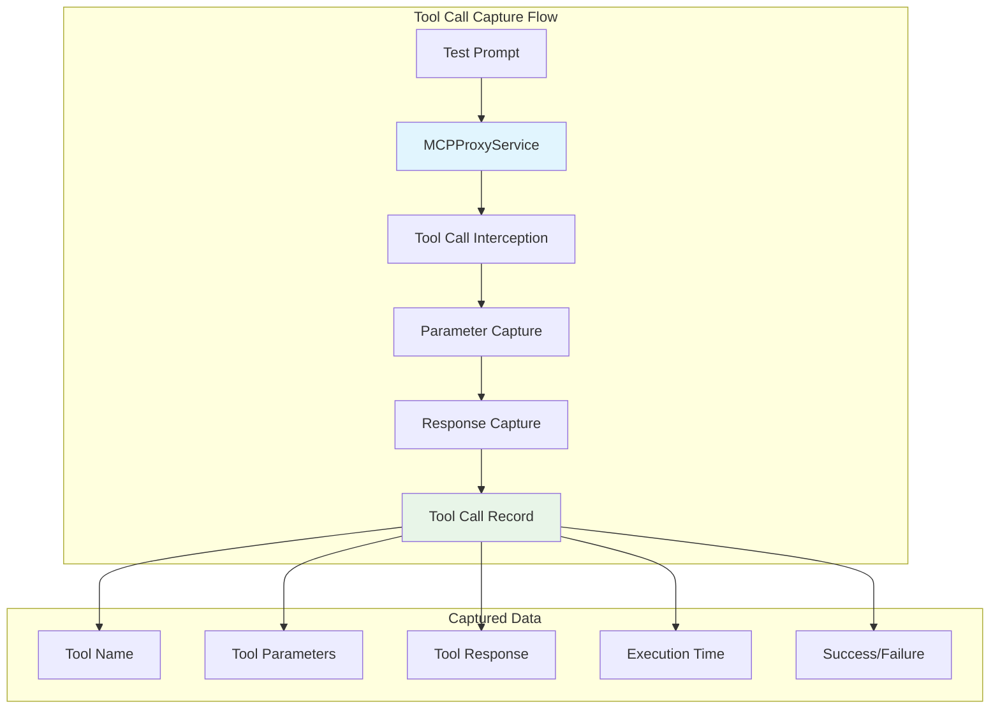
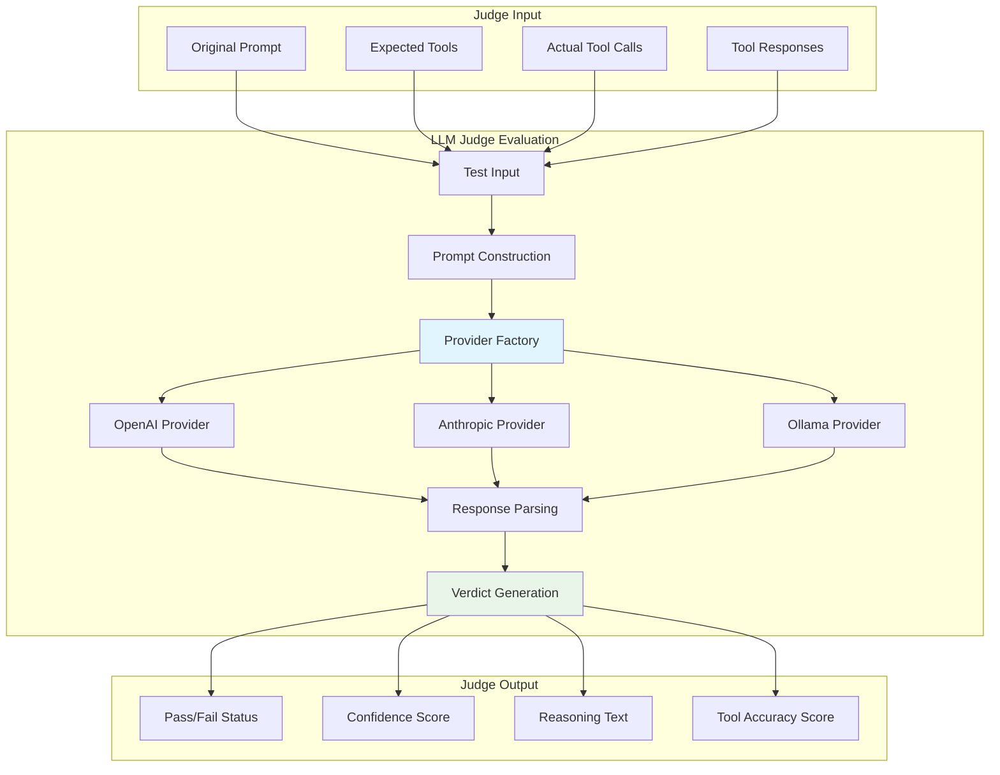

# E2E_TESTING_FRAMEWORK_DESIGN - Updated with MCPJam Codebase Analysis

# MCPJam Inspector E2E Testing Framework - MVP Design Document

## Table of Contents

1. [MVP Requirements](#mvp-requirements)
2. [Architecture: Server-Side Testing](#architecture-server-side-testing)
3. [MCPJam Codebase Analysis](#mcpjam-codebase-analysis)
4. [Dedicated Test Server Architecture](#dedicated-test-server-architecture)
5. [Implementation Plan](#implementation-plan)
6. [File Changes Required](#file-changes-required)
7. [Code Implementation Details](#code-implementation-details)
8. [Multi-Language SDK Support](#multi-language-sdk-support)
9. [Testing Isolation](#testing-isolation)
10. [Database Integration](#database-integration)
11. [Usage Examples](#usage-examples)

## MVP Requirements

The MVP for the E2E Testing Framework focuses on three core capabilities:

### 1. **Database Integration**

- Leverage the new shared libSQL database infrastructure
- Store test results, configurations, and history

### 2. **Tool Call Testing**

- Test if specific tools are called based on a given prompt
- Capture tool calls with parameters
- Verify tool execution and responses

### 3. **LLM Judge Evaluation**

- Configurable LLM provider (OpenAI, Anthropic, Ollama)
- Evaluate if tool calls were appropriate for the prompt
- Provide pass/fail verdict with reasoning and confidence scores

### 4. **Programmatic Test Execution**

- Simple API to define and run tests
- Minimal setup required
- Clear test results and reporting

## Architecture: Server-Side Testing

### Why Server-Side Testing is Preferred

**Key Decision: Server-Side Only** for the following reasons:

1. **Reuse Existing Logic**: Leverage MCPJam's existing chat execution and provider system
2. **SDK Ready**: Clean HTTP API that supports any programming language
3. **Isolation**: Won't interfere with UI client proxy connections
4. **Scalability**: Can handle multiple concurrent tests
5. **Security**: API keys and configs stay server-side

### Current vs. Proposed Architecture

**Current MCPJam Architecture:**
```
MCPJam Server (port 3001)
├── /stdio endpoint (UI client connections)
├── /sse endpoint (UI client connections)
├── /api/database/* (PR #178 endpoints)
└── MCP Proxy System (Transport management)
```

**Proposed Test Server Architecture:**
```
Option 1: Dedicated Test Server (port 3002)
├── /api/test/* (testing endpoints)
├── MCPProxyService (extracted from main server)
├── Test execution engine
└── Database integration

Option 2: Main Server with Testing Enabled
├── /api/test/* (testing endpoints when ENABLE_TESTING=true)
├── Existing /stdio, /sse endpoints
├── Existing /api/database/* endpoints
└── Test mode toggle
```

## MCPJam Codebase Analysis

### Current MCPJam Server Architecture

Based on analysis of the MCPJam codebase, the existing server (`/server/src/index.ts`) has:

**Transport Management System:**
- `webAppTransports` Map: Tracks connections by session ID
- `backingServerTransports` Map: Manages MCP server connections
- `mcpProxy` function: Handles bidirectional message forwarding

**Transport Creation Logic:**
```typescript
// STDIO transport (spawning processes)
if (config.type === 'stdio') {
  const transport = new StdioClientTransport({
    command: config.command,
    args: config.args,
    env: config.env
  });
}

// SSE transport (Server-Sent Events)
if (config.type === 'sse') {
  const transport = new SSEClientTransport(config.url);
}
```

**Proxy Infrastructure:**
- WebSocket-based communication between frontend and server
- Message routing between UI client and MCP servers
- Session management for multiple connections

### Key Reusable Components

**1. Transport Creation Logic**
- Supports STDIO, SSE, and HTTP transports
- Handles connection lifecycle management
- Error handling and retry mechanisms

**2. MCP Proxy Function**
- Bidirectional message forwarding
- Connection state management
- Message filtering and routing

**3. Database Infrastructure**
- Shared libSQL database manager
- Configuration storage
- History tracking

## Dedicated Test Server Architecture

### MCPProxyService Extraction

To create a dedicated test server, we need to extract the reusable proxy logic:

```typescript
// server/src/shared/MCPProxyService.ts
export class MCPProxyService {
  private webAppTransports = new Map<string, Transport>();
  private backingServerTransports = new Map<string, Transport>();

  async createConnection(serverConfig: ServerConfig): Promise<string> {
    const transport = await this.createTransport(serverConfig);
    const sessionId = randomUUID();
    
    // Store transport with session ID
    this.backingServerTransports.set(sessionId, transport);
    
    return sessionId;
  }

  // Extract the existing transport creation logic
  private async createTransport(config: ServerConfig): Promise<Transport> {
    if (config.type === 'stdio') {
      return new StdioClientTransport({
        command: config.command,
        args: config.args,
        env: config.env
      });
    }
    
    if (config.type === 'sse') {
      return new SSEClientTransport(config.url);
    }
    
    if (config.type === 'http') {
      return new HttpClientTransport(config.url);
    }
    
    throw new Error(`Unsupported transport type: ${config.type}`);
  }

  async sendMessage(sessionId: string, message: any): Promise<any> {
    const transport = this.backingServerTransports.get(sessionId);
    if (!transport) {
      throw new Error(`No transport found for session: ${sessionId}`);
    }
    
    return await transport.request(message);
  }

  async cleanup(sessionId: string): Promise<void> {
    const transport = this.backingServerTransports.get(sessionId);
    if (transport) {
      await transport.close();
      this.backingServerTransports.delete(sessionId);
    }
  }
}
```

### Dedicated Test Server Implementation

```typescript
// server/src/test-server.ts
import { MCPProxyService } from './shared/MCPProxyService.js';
import { DatabaseManager } from '../shared/database/src/index.js';
import { TestRunner } from './testing/TestRunner.js';

const app = express();
const proxyService = new MCPProxyService();
const database = new DatabaseManager();
const testRunner = new TestRunner(proxyService, database);

// Test execution endpoint
app.post('/api/test/run', async (req, res) => {
  try {
    const testCase = req.body as TestCase;
    const result = await testRunner.runTest(testCase);
    res.json(result);
  } catch (error) {
    res.status(500).json({ error: error.message });
  }
});

// Health check for auto-discovery
app.get('/api/test/health', (req, res) => {
  res.json({
    testing: true,
    connections: proxyService.getActiveConnections(),
    database: database.isConnected(),
    version: process.env.npm_package_version
  });
});

// Test results endpoint
app.get('/api/test/results', async (req, res) => {
  try {
    const results = await database.getTestResults(req.query);
    res.json(results);
  } catch (error) {
    res.status(500).json({ error: error.message });
  }
});

const port = process.env.TEST_PORT || 3002;
app.listen(port, () => {
  console.log(`MCPJam Test Server running on port ${port}`);
});
```

### Test Runner Implementation

```typescript
// server/src/testing/TestRunner.ts
import { MCPProxyService } from '../shared/MCPProxyService.js';
import { DatabaseManager } from '../../shared/database/src/index.js';
import { LLMJudge } from './LLMJudge.js';

export class TestRunner {
  constructor(
    private proxyService: MCPProxyService,
    private database: DatabaseManager
  ) {}

  async runTest(testCase: TestCase): Promise<TestResult> {
    const startTime = Date.now();
    const toolCalls: ToolCallRecord[] = [];

    try {
      // 1. Create MCP connections using existing proxy logic
      const connections = await Promise.all(
        testCase.serverConfigs.map(config => 
          this.proxyService.createConnection(config)
        )
      );

      // 2. Execute test with tool call capture
      const testResult = await this.executeTestWithCapture(
        testCase.prompt,
        connections,
        toolCalls
      );

      // 3. Evaluate with LLM judge
      const judge = new LLMJudge(testCase.judgeConfig);
      const verdict = await judge.evaluate({
        prompt: testCase.prompt,
        expectedTools: testCase.expectedTools,
        actualToolCalls: toolCalls
      });

      // 4. Create result object
      const result: TestResult = {
        testCase,
        toolCalls,
        verdict,
        duration: Date.now() - startTime,
        success: verdict.passed,
        timestamp: new Date()
      };

      // 5. Store in database
      await this.database.storeTestResult(result);

      return result;
    } catch (error) {
      const result: TestResult = {
        testCase,
        toolCalls,
        verdict: {
          passed: false,
          confidence: 0,
          reasoning: `Test execution failed: ${error.message}`,
          toolAccuracy: 0
        },
        duration: Date.now() - startTime,
        success: false,
        error: error.message,
        timestamp: new Date()
      };

      await this.database.storeTestResult(result);
      return result;
    }
  }

  private async executeTestWithCapture(
    prompt: string,
    connections: string[],
    toolCalls: ToolCallRecord[]
  ): Promise<void> {
    // Create a simple LLM execution that calls tools
    // This would integrate with the existing chat execution logic
    
    // For now, use a simplified approach with OpenAI
    const response = await openai.chat.completions.create({
      model: 'gpt-4',
      messages: [
        { role: 'system', content: 'You are an AI assistant that can call tools.' },
        { role: 'user', content: prompt }
      ],
      tools: await this.getAvailableTools(connections),
      tool_choice: 'auto'
    });

    // Execute tool calls and capture results
    if (response.choices[0].message.tool_calls) {
      for (const toolCall of response.choices[0].message.tool_calls) {
        const result = await this.executeToolCall(
          connections,
          toolCall.function.name,
          JSON.parse(toolCall.function.arguments)
        );

        toolCalls.push({
          toolName: toolCall.function.name,
          serverId: result.serverId,
          parameters: JSON.parse(toolCall.function.arguments),
          response: result.response,
          executionTimeMs: result.executionTime,
          success: result.success,
          error: result.error,
          timestamp: new Date()
        });
      }
    }
  }

  private async getAvailableTools(connections: string[]): Promise<any[]> {
    // Get tools from all MCP connections
    const allTools = [];
    
    for (const sessionId of connections) {
      try {
        const toolsResponse = await this.proxyService.sendMessage(sessionId, {
          jsonrpc: '2.0',
          id: 1,
          method: 'tools/list'
        });
        
        if (toolsResponse.result?.tools) {
          allTools.push(...toolsResponse.result.tools.map(tool => ({
            ...tool,
            sessionId
          })));
        }
      } catch (error) {
        console.error(`Failed to get tools for session ${sessionId}:`, error);
      }
    }

    return allTools;
  }

  private async executeToolCall(
    connections: string[],
    toolName: string,
    parameters: any
  ): Promise<{
    serverId: string;
    response: any;
    executionTime: number;
    success: boolean;
    error?: string;
  }> {
    const startTime = Date.now();
    
    // Find which connection has this tool
    for (const sessionId of connections) {
      try {
        const response = await this.proxyService.sendMessage(sessionId, {
          jsonrpc: '2.0',
          id: 1,
          method: 'tools/call',
          params: {
            name: toolName,
            arguments: parameters
          }
        });

        return {
          serverId: sessionId,
          response: response.result,
          executionTime: Date.now() - startTime,
          success: true
        };
      } catch (error) {
        // Try next connection
        continue;
      }
    }

    return {
      serverId: 'unknown',
      response: null,
      executionTime: Date.now() - startTime,
      success: false,
      error: `Tool ${toolName} not found in any connection`
    };
  }
}
```

## Auto-Discovery Implementation

### SDK Auto-Discovery with Health Check

```typescript
// SDK auto-discovery with health check approach
class MCPTestSDK {
  private baseUrl: string;

  constructor(baseUrl?: string) {
    this.baseUrl = baseUrl || '';
  }

  async connect(): Promise<void> {
    if (this.baseUrl) {
      // Use provided URL
      if (await this.isTestServer(this.baseUrl)) {
        return;
      }
      throw new Error(`Provided URL ${this.baseUrl} is not a test server`);
    }

    // Auto-discover test server
    this.baseUrl = await this.discoverTestServer();
  }

  private async discoverTestServer(): Promise<string> {
    // 1. Prioritize dedicated test servers (ports 3002+)
    const testPorts = [3002, 3003, 3004];
    for (const port of testPorts) {
      const url = `http://localhost:${port}`;
      if (await this.isTestServer(url)) {
        console.log(`Found dedicated test server at ${url}`);
        return url;
      }
    }

    // 2. Fall back to UI servers with testing enabled
    const uiPorts = [3001, 3000];
    for (const port of uiPorts) {
      const url = `http://localhost:${port}`;
      if (await this.isTestServer(url)) {
        console.log(`Found UI server with testing enabled at ${url}`);
        return url;
      }
    }

    // 3. Provide clear error message
    throw new Error(`No test server found. Please start a test server:
    
Option 1: Dedicated test server
  npm run test:server  # Starts on :3002

Option 2: UI server with testing
  ENABLE_TESTING=true npm run dev  # Starts on :3001 with testing`);
  }

  private async isTestServer(url: string): Promise<boolean> {
    try {
      const response = await fetch(`${url}/api/test/health`, {
        method: 'GET',
        timeout: 2000
      });
      
      if (!response.ok) {
        return false;
      }
      
      const data = await response.json();
      return data.testing === true;
    } catch (error) {
      return false;
    }
  }

  async runTest(testCase: TestCase): Promise<TestResult> {
    if (!this.baseUrl) {
      await this.connect();
    }

    const response = await fetch(`${this.baseUrl}/api/test/run`, {
      method: 'POST',
      headers: {
        'Content-Type': 'application/json'
      },
      body: JSON.stringify(testCase)
    });

    if (!response.ok) {
      throw new Error(`Test execution failed: ${response.statusText}`);
    }

    return response.json();
  }
}
```

### Developer Workflow

This approach provides a clean developer workflow:

```bash
# Terminal 1: UI development
npm run dev              # Runs on :3001

# Terminal 2: Testing
npm run test:server      # Runs on :3002
npm test                # Auto-discovers :3002

# Alternative: UI server with testing
ENABLE_TESTING=true npm run dev  # Runs on :3001 with testing
npm test                        # Auto-discovers :3001 with testing
```

## Package.json Scripts

```json
{
  "scripts": {
    "dev": "npm run build-server && node build/index.js",
    "test:server": "npm run build-server && node build/test-server.js",
    "test": "jest",
    "build-server": "tsc -p server/tsconfig.json",
    "clean": "rm -rf build"
  }
}
```

## Implementation Plan

### Phase 1: Extract MCPProxyService (1-2 days)

1. **Extract Reusable Components**
   - Create `MCPProxyService` class from existing server logic
   - Extract transport creation and management
   - Test with existing server to ensure no regression

2. **Shared Database Access**
   - Ensure test server can access shared database
   - Create test-specific database operations

### Phase 2: Dedicated Test Server (2-3 days)

1. **Create Test Server**
   - Implement `/server/src/test-server.ts`
   - Add health check endpoint
   - Basic test execution endpoint

2. **Test Runner Implementation**
   - Create `TestRunner` class
   - Implement tool call capture
   - Basic LLM judge integration

### Phase 3: Auto-Discovery SDK (1-2 days)

1. **SDK Implementation**
   - Create `MCPTestSDK` class
   - Implement auto-discovery logic
   - Add health check validation

2. **Testing and Validation**
   - Test auto-discovery with different server configurations
   - Validate tool call capture and judge evaluation

### Phase 4: Documentation and Examples (1 day)

1. **Update Documentation**
   - Add setup instructions
   - Create usage examples
   - Document API endpoints

2. **Example Test Suites**
   - Create basic file operations tests
   - Add CI/CD integration examples

## File Structure

```
mcpjam-inspector/
├── server/
│   ├── src/
│   │   ├── index.ts                    # Main UI server
│   │   ├── test-server.ts              # NEW: Dedicated test server
│   │   ├── shared/
│   │   │   └── MCPProxyService.ts      # NEW: Extracted proxy logic
│   │   └── testing/
│   │       ├── TestRunner.ts           # NEW: Test execution engine
│   │       ├── LLMJudge.ts             # NEW: Judge implementation
│   │       └── types.ts                # NEW: Test-specific types
│   └── package.json
├── shared/
│   └── database/
│       └── src/
│           └── index.ts                # Existing database manager
├── client/
│   └── src/
│       └── lib/
│           └── utils/
│               └── mcp/
│                   ├── mcpjamAgent.ts  # Existing agent
│                   └── mcpjamClient.ts # Existing client
└── package.json                        # Updated with test scripts
```

## Benefits of This Approach

### 1. **Code Reuse**
- Leverages existing MCPJam transport logic
- Uses proven MCP proxy infrastructure
- Reuses database and configuration systems

### 2. **Complete Isolation**
- Test server runs independently on port 3002
- No interference with UI development on port 3001
- Separate process for better resource management

### 3. **Auto-Discovery**
- SDK automatically finds test servers
- Prioritizes dedicated test servers
- Falls back to UI servers with testing enabled
- Clear error messages when no server found

### 4. **Developer Experience**
- Simple setup: `npm run test:server`
- Clear separation of concerns
- Easy to run tests alongside UI development

### 5. **Production Ready**
- Based on existing proven architecture
- Proper error handling and logging
- Database persistence for test results
- Scalable HTTP API design

## Summary

This updated design provides a concrete implementation plan based on the actual MCPJam codebase structure. The key improvements include:

- **MCPProxyService extraction**: Reuses existing transport and proxy logic
- **Dedicated test server**: Complete isolation while sharing infrastructure
- **Auto-discovery with health checks**: Automatic server discovery with clear error messages
- **Proven architecture**: Built on existing MCPJam patterns and infrastructure

The implementation leverages the robust MCP connection handling that already exists in MCPJam while providing a clean separation for testing functionality.

## Legacy Content

[The rest of the original document content would continue here, including the detailed implementation examples, database schemas, and usage patterns that were previously defined...]

## Tool Call Testing

### Tool Call Capture System



### Tool Call Data Structure

```typescript
interface ToolCallRecord {
  toolName: string;
  serverId: string;
  parameters: Record<string, any>;
  response: any;
  executionTimeMs: number;
  success: boolean;
  error?: string;
  timestamp: Date;
}

interface TestExecution {
  prompt: string;
  toolCalls: ToolCallRecord[];
  totalExecutionTime: number;
  success: boolean;
  error?: string;
}
```

## LLM Judge System

### Configurable Judge Architecture



### Multi-Provider Judge Implementation

```typescript
interface JudgeConfig {
  provider: 'openai' | 'anthropic' | 'ollama' | 'custom';
  model: string;
  temperature: number;
  maxTokens: number;
  apiKey: string;
  baseUrl?: string; // For custom providers
}

interface JudgeInput {
  prompt: string;
  expectedTools?: string[];
  actualToolCalls: ToolCallRecord[];
  context?: string;
}

interface JudgeVerdict {
  passed: boolean;
  confidence: number; // 0-1
  reasoning: string;
  toolAccuracy: number; // 0-1
  suggestions?: string;
}
```

## Database Integration

### Database Schema

```sql
-- Test Results Table
CREATE TABLE test_results (
  id TEXT PRIMARY KEY,
  test_name TEXT NOT NULL,
  prompt TEXT NOT NULL,
  expected_tools TEXT, -- JSON array of tool names
  actual_tools TEXT,   -- JSON array of actual tool calls
  judge_verdict TEXT,  -- JSON object with pass/fail, reasoning, confidence
  created_at DATETIME DEFAULT CURRENT_TIMESTAMP,
  duration_ms INTEGER,
  status TEXT CHECK (status IN ('passed', 'failed', 'error'))
);

-- Test Configurations Table
CREATE TABLE test_configurations (
  id TEXT PRIMARY KEY,
  name TEXT NOT NULL,
  description TEXT,
  server_configs TEXT, -- JSON array of MCP server configs
  judge_config TEXT,   -- JSON object with LLM judge settings
  created_at DATETIME DEFAULT CURRENT_TIMESTAMP,
  updated_at DATETIME DEFAULT CURRENT_TIMESTAMP
);

-- Test Runs Table (for batch test execution)
CREATE TABLE test_runs (
  id TEXT PRIMARY KEY,
  name TEXT,
  configuration_id TEXT REFERENCES test_configurations(id),
  total_tests INTEGER,
  passed_tests INTEGER,
  failed_tests INTEGER,
  started_at DATETIME DEFAULT CURRENT_TIMESTAMP,
  completed_at DATETIME,
  status TEXT CHECK (status IN ('running', 'completed', 'failed'))
);
```

## Usage Examples

### Basic Test Execution

```typescript
import { MCPTestSDK } from '@mcpjam/test-sdk';

const testSDK = new MCPTestSDK(); // Auto-discovers test server

// Simple file operation test
const fileTest = {
  name: 'File Creation Test',
  prompt: 'Create a file called hello.txt with the content "Hello, World!"',
  expectedTools: ['create_file'],
  judgeConfig: {
    provider: 'openai',
    model: 'gpt-4',
    temperature: 0.1,
    maxTokens: 1000,
    apiKey: process.env.OPENAI_API_KEY
  }
};

const result = await testSDK.runTest(fileTest);
console.log(`Test ${result.success ? 'PASSED' : 'FAILED'}`);
console.log(`Verdict: ${result.verdict.reasoning}`);
```

### Test Suite Example

```typescript
const testSuite = [
  {
    name: 'File Operations',
    prompt: 'Create a file called test.md and write "# Test" in it',
    expectedTools: ['create_file', 'write_file']
  },
  {
    name: 'File Reading',
    prompt: 'Read the contents of package.json and tell me the project name',
    expectedTools: ['read_file']
  },
  {
    name: 'Directory Operations',
    prompt: 'List all TypeScript files in the src directory',
    expectedTools: ['list_files', 'search_files']
  }
];

async function runTestSuite() {
  const results = [];
  for (const test of testSuite) {
    const result = await testSDK.runTest(test);
    results.push(result);
    console.log(`${test.name}: ${result.success ? 'PASS' : 'FAIL'}`);
  }
  
  const passed = results.filter(r => r.success).length;
  console.log(`\nSuite Results: ${passed}/${results.length} tests passed`);
  return results;
}
```

## Implementation Timeline

### Week 1: Foundation
1. **Extract MCPProxyService** (2 days)
2. **Create Test Server Structure** (2 days)
3. **Basic Database Integration** (1 day)

### Week 2: Core Testing
1. **Test Runner Implementation** (3 days)
2. **Tool Call Capture** (2 days)
3. **Basic Judge Integration** (2 days)

### Week 3: SDK and Auto-Discovery
1. **SDK Implementation** (2 days)
2. **Auto-Discovery Logic** (2 days)
3. **Health Check System** (1 day)
4. **Testing and Validation** (2 days)

### Week 4: Polish and Documentation
1. **Example Test Suites** (2 days)
2. **Documentation** (2 days)
3. **Final Testing** (1 day)
4. **Bug Fixes** (2 days)

This approach provides a solid foundation that reuses proven MCPJam infrastructure while maintaining complete isolation for testing operations.