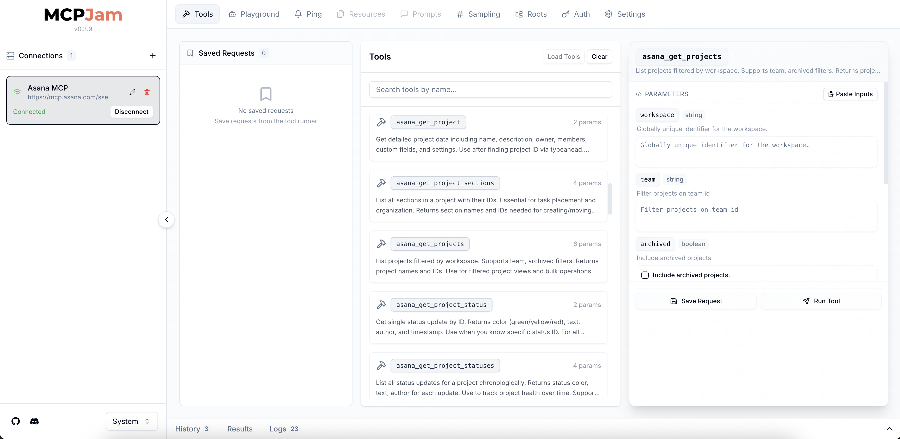

# MCPJam Product Spec (Building v.1.0.0)
[](https://discord.gg/JEnDtz8X6z)


There's a clear need for good tooling for the MCP developer community. Good dev tooling lowers the barrier to entry for MCP devs, accelerating the growth and interest in this space. That mission is what inspired the MCPJam inspector project. Since we started working on the MCPJam inspector, we've nearly reached 400 stars on GitHub and an active community of contributors. Many MCP devs I've spoken prefer to use MCPJam over other dev tools. 

However, I think MCPJam is far from being a mature product. This document outlines our plan to build an enterprise-grade open source MCP dev tool for the MCP community. Our v1.0.0 release. 

## Current state of MCPJam 

If you're new to [MCPJam](https://github.com/MCPJam/inspector), it is highly recommended to play around with the product first to get a general understanding of the current state of this project. 

```
npx @mcpjam/inspector@latest
```

Currently, MCPJam is fully compliant to the protocol. 
- Supports connections to STDIO, SSE, Streamable HTTP. 
- Nearly spec compliant, improvements / tweaks still needed. 
- OAuth flow and dynamic client registration is supported for remote servers. 
- Support for connecting to multiple servers at once
- LLM playground compliant with MCP. Support for models like Anthropic, OpenAI, and Ollama models. 

The product is in working condition, but is not in a stable state. Not all logs / errors are shown, so when something doesn't work, user is given no clue. Connections and the auth flow is flaky at times. The UX in certain areas isn't intuitive. We want v1.0.0 to be that stable state with known existing issues solved. 



## v1.0.0 Product Requirements 
A high quality MCP dev tool must provide the following listed below. 
<details>
<summary><strong>Smooth connection experience</strong></summary>

- Connections must support STDIO, SSE, and Streamable HTTP. SSE and Streamable connection experience is unified. 
- STDIO connections must support remote packages, like running `npx @modelcontextprotocol/server-everything`, and local files like running `node dist/index.js`. Any CLI command works
- Remote connections must support the entire [OAuth spec](https://modelcontextprotocol.io/specification/draft/basic/authorization) such as Dynamic Client Registration. 
- For all connections, we must be able to configure timeouts. For STDIO, allow user to add environment variables. For SSE/HTTP, allow the user to configure headers like Bearer tokens. 
- A really simple interface for configuring connections. MCPJam must be friendly for novice developers. 
- Must support the ability to connect to multiple MCP servers. Ability to edit, delete, duplicate connections. 
- Connections are saved on local storage and restored on project load, along with its authorization info if applicable
- Ability to disconnect and reconnect from an MCP server
- The ability to load in a `mcp.json` file? Not sure how useful this is, but some may find it easier to load / paste in their pre-existing mcp config file

</details>

<details>
<summary><strong>Implements the entire protocol</strong></summary>

  - ([Tool Calling](https://modelcontextprotocol.io/docs/concepts/tools)) Spec compliant to tool use. Provide a GUI to allow user to functionally test their tools. Uses correct MCP error handling. 
-  ([Prompts](https://modelcontextprotocol.io/docs/concepts/prompts)) Support for displaying prompts. User can function test displaying prompts. 
-  ([Roots](https://modelcontextprotocol.io/docs/concepts/roots)) Allow the MCP inspector, which acts as a client, to expose roots to any server it connects to. 
-  ([Resources](https://modelcontextprotocol.io/docs/concepts/resources)) Allow the MCP inspector to load resources from an MCP server 
-  ([Sampling](https://modelcontextprotocol.io/docs/concepts/sampling)) Sampling would only work within the playground because it needs an LLM. 
-  ([Elicitation](https://modelcontextprotocol.io/docs/concepts/elicitation)) We can test for elicitation in both the functional tests and in LLM playground. 

Few MCP clients have the spec fully implemented. MCPJam should be one of the first to be entirely spec compliant

</details> 

<details>
<summary><strong>Smooth testing and debugging experience</strong></summary>

- Properly error handles on connection issues and server implementation issues. 
- Start off building MCP testing frameworks, with automated functional testing for tool calls.  
- Full logs from the client and proxy server are displayed and copyable on the UI.

</details> 

<details>
<summary><strong>Simple navigation UI</strong></summary>

This project must be friendly for developers novice to MCP. MCPJam is an education tool as much as it is a testing tool. To do this, the UI cannot be cluttered, presenting ideally just one CTA at every page.

</details> 

<details>
<summary><strong>CLI Shortcuts & CLI Mode</strong></summary>

- Calling `npx @mcpjam/inspector node build/index.js` on the root directory of a JS MCP server for example, opens up the inspector with the server pre-loaded. 
- Same shortcut to connect to MCP servers using SSE/HTTP bu running `npx @mpcpjam/inspector sse http://localhost:3000/mcp` for example. 
- Support for the entire experience of [CLI mode](https://github.com/modelcontextprotocol/inspector?tab=readme-ov-file#cli-mode) of the original inspector. This is useful for automating common triggers.

</details> 

## v1.0.0 Roadmap and Timeline 
### Re-write the core logic to use [Mastra](https://mastra.ai/en/docs/tools-mcp/mcp-overview) and [Vercel AI SDK](https://ai-sdk.dev/docs/introduction) (~1 week) 
At a high level, an MCP Client object represents a single connection to an MCP server. An agent holds the LLM layer and can contain several MCP clients. The agent can use these MCP clients for tool calling and other MCP capabilities.

We built a custom MCP client and agent for the inspector. The classes are `MCPJamAgent` and `MCPJamClient`. Details about their implementation can be read here. The issue is that we did a poor job of implementation. The clases is not easy to follow or use. We want to migrate these classes to using Mastra. Mastra has a `MCPClient` class and an `Agent` class, which follows the same structure as our classes and supports MCP. Read Mastra docs [here](https://mastra.ai/en/docs/tools-mcp/mcp-overview).  

The benefits of moving over to Mastra and Vercel AI SDK are: 
- Uses the industry standard tooling. Mastra and Vercel AI SDK are leading Typescript libraries in the MCP / Agents space. This ensures we have the latest and correct MCP implementation 
- We no longer have to maintain our own Agent and Client classes. 
- Using Vercel AI SDK enables us to easily swap out models. 

### UX improvements (~1 week) 
MCPJam needs to feel like an enterprise grade product and the UX needs to behave as such. Current critiques of the existing UI are: 
- The server connection flow is hard to figure out. There are too many CTAs, not a single focus point for the user at each page. The UI needs to be simplified. 
- Layout is confusing. We have connections on the left pane, pages at the topbar, and results / logging on the bottom. 
- Styling is inconsistent. Components are not uniform. The entire platform feels vibe coded. 

What needs to get done: 
- We currently use TailwindCSS for styling and we'll keep it. We'll be migrating UI over to [ShadCN](https://ui.shadcn.com/) components. ShadCN has become an industry standard component library for building AI applications.
- We did a bad job of turning repetitive UI into components. Refactors must be done at every opportunity. 
- Reshuffle the layout. Page navigation will be on the left bar. Server connections will appear as tabs on the the top bar. 
  - Pages will include Home, Servers, Playground, Resources, Prompts, Sampling, Roots, Ping, Auth. 
  - The Server page is where the user can configure their server connections. Save, edit, delete 
  - Auth page should always be enabled to allow for OAuth flow testing. 
  
### CLI shortcuts (~2 days)
- Implement CLI shortcuts mentioned in the product requirements

### Become fully spec compliant (~3 days) 
We are nearly fully compliant with MCP. I did some testing and there seems to be some instability with connections. Manually passing in Bearer auth tokens do not work. 

## How to contribute
MCPJam wouldn't be where its at right now without the help of the MCP community and their contributions. Please contribute your ideas to this doc, your ideas are greatly appreciated. If you're interested in contributing to this doc or the project, follow follow instructions in our [CONTRIBUTING.md](https://github.com/MCPJam/inspector/blob/main/CONTRIBUTING.md). We communicate on [Discord](https://discord.com/invite/Gpv7AmrRc4). 

https://www.mcpjam.com/

## Resources / Q&A

### Links
- [MCPJam Repo](https://github.com/MCPJam/inspector)

- [Discord](https://discord.com/invite/Gpv7AmrRc4)

- [Instructions to be a contributor](https://github.com/MCPJam/inspector/blob/main/CONTRIBUTING.md)

- [Mastra Docs](https://mastra.ai/en/docs)

- [ShadCN Docs](https://ui.shadcn.com/)

- [Vercel AI SDK](https://vercel.com/docs/ai-sdk)

#### Why not directly work on Anthropic's inspector? 
We've been asked this several times by people in the community: "why don't you contribute directly to [@modelcontextprotocol/inspector](https://github.com/modelcontextprotocol/inspector)"? The reason why we decided to build our own is because we think the speed of progress made on Anthropic's inspector hasn't caught up to the speed of changes in the protocol, and the dev community's needs. Approvals for PRs are really slow, and a lot of parts of the protocol haven't been implemented. Anthropic's project lacks clear direction. We want to build faster and implement the protocol as it changes. 